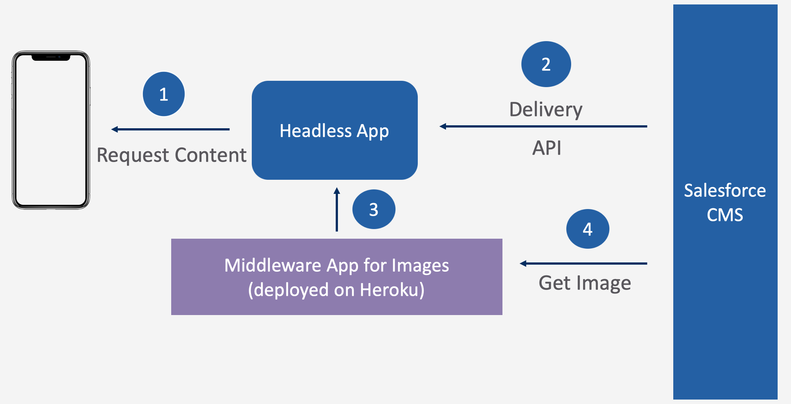

# CMS Headless Middleware Application
This Repo contains the code & config for the Middleware Application which serves the images to Headless Application: [sample extension for CMS Integration](https://github.com/pravngaur/sfcc-sample-apps/tree/cms_reference_integration)

# Architecture

This is very light Node application -- which makes an API call to Salesforce CMS to get the images over the API.
Once the image is received, this App stores the images locally to serve the images from the local storage(to avoid duplicate API calls). All future requests for the same image from Healess application is served from the locally stored image.

# Code & Config

## Salesforce Connected App
Please create a Connnected-App in Salesforce Org(having the CMS application to connect with).

## Create config.js
Once the connected app is configures -- provide the credentials & token details in this middleware application.
For that, make a duplicate file of src/config-example.js & rename the new file to config.js
Provide the required details.

## cmsHandler.js
This Module contains the code related to API call to get the images from CMS. API returns Images are buffer, which are then converted & stored locally. Review the code for more details.

## expressHandler.js
Module to start & configure the Express server.

# Starting the server
This application uses a Express server, follow the steps below to run this application:
- Clone this repo
- Install the node packages
- Start the server: node src/expressHandler.js

You should get a success message, else please debug what's issue.

# Access the Application

You can start using this application from browser or from Headless Application. 
Sample URL: http://localhost:5000/getContent?imageName=X6community

# Query Parameter
__imageName__ is the query param which this application expects in the URL.
The name of the image should be same as returned in the [Delivery Channel API](https://developer.salesforce.com/docs/atlas.en-us.chatterapi.meta/chatterapi/connect_resources_managed_content_delivery_channel.htm) response.
Please note: the response of this API depends upon the Content Type in CMS.
